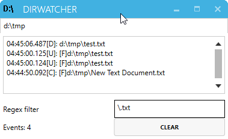

Dirwatcher
==========

This is a simple reactive filesystem watcher for windows based on [ReactiveUI](http://reactiveui.net/) and [MahApps.Metro](https://github.com/MahApps/MahApps.Metro) 

Quit: `Ctrl-W` or `Ctrl-Q`
